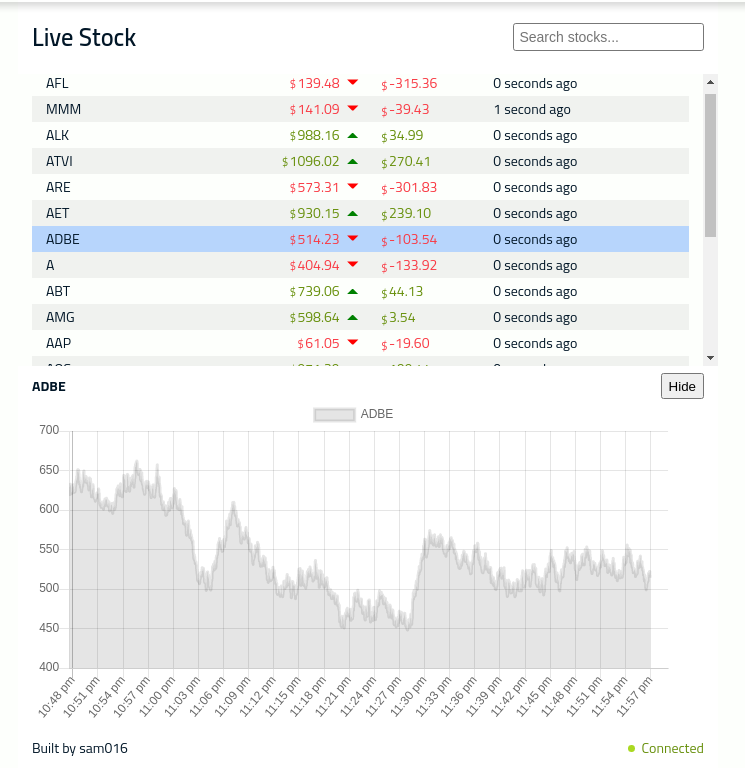
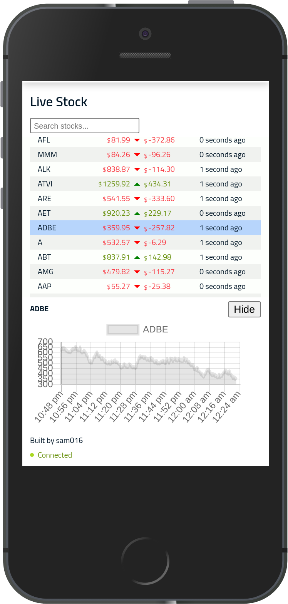

# Fake live stock

App to depict live stock from fake stock server using websocket




Repository includes

1. **server** - express server which sends fake data over websocket
2. **client** - react app to show the live data along with chart

## How to run

### Running server

```bash
cd server
npm run dev
```

### Running client

```bash
npm start
```
